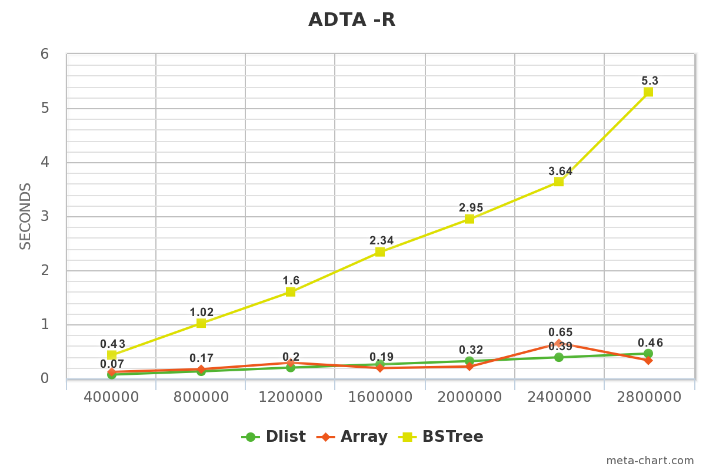
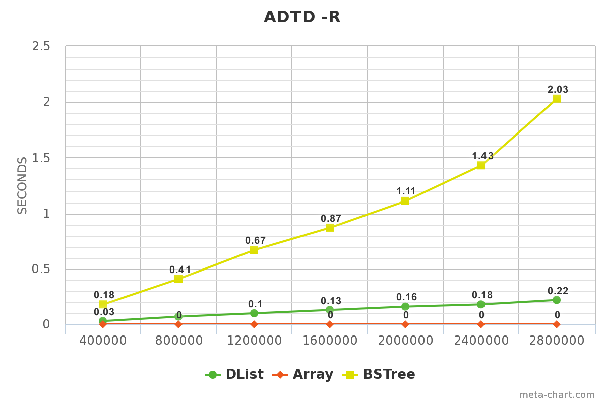

# Performance Study Report
**B05202049 詹雨安** 

## 資料結構的實作


### DList

DList 的資料結構是把每份 data 配上加兩個 pointer 封包起來成為 DListNode，而每個 DListNode 裡頭的兩個 pointer 會分別指向前一個和後一個 DListNode，藉此將所有 DListNode 串接起來形成一個 DList。

實作部分，基本上是照這個概念去寫 DList 和 DListNode 這兩個 class。比較值得一提的是我們會在 DList 裡面寫一個 iterator 的 friend class，寫的方式是透過前述的那些 pointer 來讓 iterator 在整個 DList 裡面前進後退，有了它以後對於要計算 DList 的大小、或是找出某組資料的位置時，可以直接用 for loop 快速完成（如下）

```
for(iterator i = begin(); i != end(); i++) {
	可在這裡針對第 i 個 DListNode 做 count 的累加計算或是 find 的判別
}
```

此外，在 DList 裡頭有個 pointer 指向第一個 DListNode，我們命名為 `_head`，不過初始前這個 pointer 會先指向一個 dummy Node，寫法如下：

`_head->_prev = _head->_next = _head;`

開始新增 DListNode 以後，這個 dummy Node 會變成 `end()` iterator 所指向的位置，而不再是 `_head`。有了它會讓 iterator 的使用符合格式（也就是讓 `end()` 的前一項是最後一個 DListNode），另外也可以解決在 constructor 在初始化時沒有資料不知道要指向哪裡的問題。

`sort()` 的部分，我是用最常見的 bubble sort，只是效率很差，是 O(n^2)。

我選擇用這樣的實作方式是因為這份作業給的 code 似乎已經很明確指定整個結構的安排，所以主要就是在 implement 各個子函數，更改的自由度並不是很高。

DList 論優點的話，我覺得就只是直觀且好實作，隨時想要加入或刪除 DListNode 都很方便，不需要像 BST 一樣還得去 handle 各種不同情況時執行 `erase()` 的 case。同時它可以直接把不同地方的離散資料串起來，而不像 Array 一定要用連續的大塊記憶體來存。

至於缺點就是在 access 特定位置的資料時會很慢，要讓 iterator 一個一個向前跑，不像 Array 可以直接給一個座標就立即 access 資料。在找特定資料時也得往前一個一個找，不如理想的 BST 有效率。另外就是如果某個 DListNode 的 pointer 壞掉，整個 DList 就斷掉了。

### Array

Array 的資料結構是當插入新資料時，如果一開始沒有安排記憶體，就從 heap 裡面去 new 一些記憶體出來裝資料。如果資料滿了，就再重新 new 原記憶體的兩倍出來，將原記憶體的內容 copy 過去後插入新的資料。

實作方式非常簡單，只要寫一個 Array class，裡面除了 `_data` 這個 array 以外，外包 `_size` 和 `_capacity` 這兩個數值，前者負責記當前已經存的資料量，後者記當前所提出的記憶體可裝之資料量。當 `_size` 跟 `_capacity` 一樣大時，如果 `push_back` 新的資料，就將 `_capacity` double 後再以重新提 `_capacity` 大小的記憶體出來存原本的資料，然後把新資料塞進去。

比較特別的是，當要刪除某筆資料時，會直接把尾端的資料補進來，以保持記憶體是連續緊緻的。

用這種實作方式的原因跟 DList 一樣，因為太過直觀且自由度不高，所以就很自然的寫成這樣了。

優點的部分，我覺得 Array 的強項在 access 指令位置非常快，原因是它存記憶體是連續的在存，所以可以在 iterator 做 `+=` 的 operator overloading。另外如果突然有筆資料失效，並不會像 DList 一樣會影響到 access 其他筆資料。

缺點就是每次都要跟 heap new 一大塊空間，有點浪費記憶體。

### BSTree

BST 的資料結構很直觀，第一個資料叫做 root，第二筆資料跟 root 比大小，比較大就放右邊，otherwise 放左邊。後續加入的資料插入法也是一樣的概念：比大小比輸了就再跟左邊的比，贏了就跟右邊的比，直到沒有對手時，那個位置就是這筆資料的位置。

我的實作方式是寫 BSTreeNode 和 BSTree 這兩個 class。BSTreeNode 除了要存的資料 `_data` 以外，還配了三個 pointer，分別是 `_parent`、`_left`、`_right`，分別指向某個 BSTreeNode 上方的、左下方的、右下方的 BSTreeNode。如果指的地方沒有 BSTreeNode，則設為 NULL。

在 BSTree 的 class 裡頭，我則是存了 `_root` 和 `_dummy` 這兩個 pointer，前者存 root 處 BSTreeNode 的位置，其 `_parent` 會是 NULL。如果當下沒有任何資料，`_root` 會被設為零，這也是我用來判斷 `empty()` 的方式。後者被我用來接在數值最大的 BSTreeNode 的右方（也就是它的 `_right`）的位置，其 `_left` 會指向最大的 BSTreeNode。也因此當 iterator 指向 `_dummy` 時，其所在位置就是定義上的 `end()`。

在寫 BST 的過程中，我最一開始是先處理 `insert()` 的部分。我的方法是在 private 裡面寫一個 `InsertAtNode()` 的函數來透過 recursive 的方式在 BSTree 裡面移動並和各個 BSTreeNode 比大小，以找到適合的位置將資料安插進去。在 insert 的過程中，如果這筆資料比原本 BSTree 裡頭最大的資料還要大，`_dummy` 的 `_left` 、這筆資料的 `_right` 和原本最大資料的 `_right` 的指向就會被重新安排成符合我原先定義的形式。 

第二部分是要處理 iterator 的 operator overloading。其中特別要提的是 `++`，這部分要讓它能實現 InOrder Traversal。我的判定方法是如果在 `_right` 找不到資料，就用我寫的一個叫做 `findNextMaxOnTop()` 的函數，沿著 BSTree 往上爬，直到第一個可以右轉的節點，該節點轉過去就是下一筆資料的所在之處。如果在 `_right` 有 BSTreeNode，就找以這個 BSTreeNode 為 root 的 subtree 下最小的 BSTreeNode 當下一筆資料。當這兩個情況都不滿足時，說明 `_right` 會直接指向 `_dummy`，也就是 iterator 的 `end()` 的位置。

最後實做起來我覺得最複雜的是 BSTree 裡面 `erase()` 這個函數。難處在實在有太多種不同的 case，在 handle 各種 pointer 更新連結方式時容易粗心造成漏失。我大體上把 `erase()` 分成五種情況：

1. `_right` 指向 `_dummy` 
2. `_left`、`_right` 都是 NULL
3. `_left` 是 NULL、`_right` 不是 NULL
4. `_left` 不是 NULL、`_right` 是 NULL
5. `_left`、`_right` 都不是 NULL

針對第一種，需要特別處理的就是要重新安排新的最大 BSTreeNode 的 pointer。第二、三、四種要將這個 BSTreeNode 的 parent 指向自己的那個 pointer 分別設為 NULL、原 BSTreeNode 的 `_right`、原 BSTreeNode 的 `_left`。第五種則是要找到 BSTreeNode 的 successor 來取代自己，同時也要 handle successor 原本位置的 BSTreeNode 重新連結。

以上五種情況都要考慮到如果刪掉的是 `_root` 時，要安排新的 `_root` 位置。如果刪光了，就要將 `_root` 設為零。判斷完五種狀況後，我會再針對當下情況統一去更新 `_dummy` 和最大的 BSTreeNode 的 pointer 指向。

我之所以選擇用有 `_parent` 的 BSTreeNode 來實作，是因為在做 BSTree 的向上 tracing 時會很方便，感覺也比較直覺。其餘一些工具函數的設計，則是我在列出各種比大小、找 BSTreeNode 的 case 後，把想出來覺得有需要的函數實作出來用。

BSTree 的優點在資料每次插入後都會被 sort 好，理想情況下比較 balanced 的 BST 搜尋效率大約是 O(logN)，最差的情況也頂多變成 O(N)。缺點就是在做 `insert()` 和 `erase()` 時會因為要 handle 比大小和判斷各種 case 重新串接 pointer 導致效率降低。

## 實驗比較

### 實驗設計

我利用 `adta -r` 和 `adtd -r` 這兩個指令搭上不同的物件數量，針對三種 ADT 做 runtime 測試，並將結果以折線圖做比對分析。

### 實驗預期

在 `adta -r` 的部分，估計 BSTree 會是耗時最久的，因為在 insert 的過程中要執行排序的判定， Array 和 DList 只要將新資料直接接在尾端即可。

在 `adtd -r` 的部分，BSTree 應該仍會花最久時間，因為我在寫 clear 時是持續的在 pop_front，所以 BSTree 得花時間去找 `begin()` 的位置。Array 會是最快的，因為只要一次性的將記憶體還給系統就好。

### 實驗比較

以下橫軸代表新增/刪除的物件數量，縱軸代表所花的時間。由圖表可知 BSTree 雖然強項在搜尋，但新增和刪除方面因為要花時間排序會比較耗時。但是如果我們在 DList 和 Array 也實作 insert 的同時立即完成排序的話，效率會應該不如 BSTree，因為 iterator 需要經過的 node 數量會比較多。




